# 다중 모달 생체 자극 진단 및 치료 시스템

<div align="center">
  
</div>

## 💡 개요

이 프로젝트는 복수의 무선 기기를 이용한 다중 모달 생체 자극 진단 및 치료 시스템의 구현입니다. 본 시스템은 여러 블루투스 무선 기기를 통해 ECG, EMG, EEG 등 다양한 생체 신호를 실시간으로 모니터링하고, 이 데이터를 분석하여 TENS 전기 자극 치료와 실시간으로 연동합니다.

본 시스템은 특허 **"복수의 무선 기기를 이용한 다중 모달 생체 자극, 진단 및 치료 시스템과 그 방법 (Multi-Modal Bio-Stimulation, Diagnosis and Treatment System Using Multiple Wireless Devices and Method for the Same)"**에 기반하고 있습니다.

## 🚀 주요 기능

- **실시간 다중 생체 신호 모니터링**
  - ECG (심전도) 실시간 모니터링
  - EMG (근전도) 실시간 모니터링
  - EEG (뇌파) 실시간 모니터링
  - PPG 및 심박 변이도(HRV) 모니터링
  - GSR (피부 전도도) 모니터링

- **고급 신호 처리 및 분석**
  - 트랜스포머 기반 이상 거동 분석
  - AI 기반 생체 신호 패턴 인식
  - 가상 신호 시뮬레이션 및 데이터 세트 생성

- **다중 모달 자극 제어**
  - TENS 전기 자극 치료 실시간 연동
  - 광 자극 (빛 치료) 제어
  - 열 자극 제어
  - 진동 자극 제어

- **통합 시스템 기능**
  - 폐루프(Closed-loop) 시스템 구현
  - 개인화된 자극 프로필 자동 생성
  - 다중 무선 기기 간 동기화 및 협조 제어

## 🔧 시스템 구성요소

### 1. 중앙 제어 시스템
- **AI 기반 데이터 분석 및 자극 제어**
  - 다양한 생체 신호의 실시간 통합 분석
  - 개인별 최적 자극 파라미터 결정
  - 생체 신호 패턴에 기반한 진단 기능

- **트랜스포머 기반 이상 거동 분석**
  - 멀티헤드 셀프 어텐션 메커니즘
  - 시계열 생체 신호 패턴 감지
  - 이상치 탐지 및 진단 정보 생성

- **블루투스 통신 관리**
  - 복수 무선 기기와의 안정적 연결 유지
  - 데이터 손실 최소화 및 실시간 처리
  - 기기 간 동기화 관리

- **폐루프 피드백 시스템**
  - 자극 효과의 실시간 모니터링
  - 생체 반응 기반 자극 파라미터 자동 조정
  - 적응형 자극 전략 구현

### 2. 무선 측정 기기
- **ECG 모니터링 기기**
  - 고해상도 ECG 측정
  - 실시간 신호 처리 및 필터링
  - 부정맥 등 이상 징후 사전 감지

- **EMG 모니터링 기기**
  - 다채널 근전도 측정
  - 근육 활성도 및 피로도 평가
  - 근긴장 이상 탐지

- **EEG 모니터링 기기**
  - 뇌파 리듬 실시간 분석
  - 주파수 대역별 활성도 분석
  - 인지 상태 및 스트레스 수준 평가

- **기타 센서 모듈**
  - PPG 및 HRV 측정
  - GSR(피부 전도도) 측정
  - 체온 및 움직임 감지

### 3. 자극 모듈
- **TENS 자극 모듈**
  - 다양한 파형 및 주파수 지원
  - 정밀한 전류 강도 조절
  - 여러 채널의 독립적 제어

- **다중 모달 자극 기능**
  - 광 자극(빛 치료)
  - 열 자극
  - 진동 자극
  - 소리 자극

## 🧠 트랜스포머 기반 이상 거동 분석

본 시스템의 핵심 기능 중 하나는 트랜스포머 모델을 활용한 생체 신호의 이상 거동 분석 기능입니다. 이 기능은 다음과 같은 특징을 가집니다:

- **멀티헤드 셀프 어텐션 메커니즘**: 시계열 데이터 내의 복잡한 시간적 패턴을 포착
- **위치 인코딩**: 시퀀스 내 위치 정보를 보존하여 시간적 패턴 분석 강화
- **재구성 오차 기반 이상 감지**: 정상 패턴과의 차이를 기반으로 이상 징후 탐지
- **설명 가능한 AI 접근**: 어텐션 가중치 시각화를 통한 결과 해석 가능
- **다양한 생체 신호 지원**: ECG, EMG, PPG, EEG, GSR 등 다양한 신호 유형 분석
- **실시간 처리 능력**: 저지연 분석으로 즉각적인 치료 파라미터 조정 지원

## 📂 폴더 구조

```
/
├── central_system/              # 중앙 제어 시스템 구현
│   ├── transformer_analysis.py  # 트랜스포머 기반 이상 거동 분석 모듈
│   ├── bluetooth_manager.py     # 블루투스 통신 관리 모듈
│   ├── data_processor.py        # 데이터 처리 모듈
│   ├── ai_controller.py         # AI 기반 제어 모듈
│   └── config.py                # 시스템 구성 설정
│
├── device_ecg/                  # ECG 모니터링 기기 관련 코드
├── device_hrv/                  # 심박/HRV 모니터링 기기 관련 코드
├── tens_module/                 # TENS 자극 모듈 구현
│
├── data_simulation/             # 가상 신호 시뮬레이션 코드
│
├── ai_models/                   # AI 분석 및 제어 모델
│   └── transformer_anomaly_detector.py  # 트랜스포머 기반 이상 감지 모델
│
├── visualization/               # 데이터 시각화 도구
├── docs/                        # 문서 및 사용자 매뉴얼
│
├── examples/                    # 예제 코드
│   └── multi_device_anomaly_detection.py  # 다중 기기 이상 감지 예제
│
├── assets/                      # 이미지, 다이어그램 등 리소스
│   └── system_overview_diagram.svg  # 시스템 개요 다이어그램
│
├── run_simulation.py            # 시뮬레이션 실행 스크립트
├── run_system.py                # 실제 기기 연결 실행 스크립트
└── requirements.txt             # 필요 라이브러리 목록
```

## ⚙️ 설치 및 실행 방법

### 필요 조건
- Python 3.8+
- TensorFlow 2.6+
- PyTorch 1.10+
- NumPy, SciPy, Pandas
- Matplotlib, Seaborn
- PyBluez 또는 Bleak (블루투스 통신)

### 설치
```bash
pip install -r requirements.txt
```

### 실행
```bash
# 시뮬레이션 모드
python run_simulation.py  

# 또는 실제 기기 연결 모드
python run_system.py      
```

### 예제 실행
```bash
# 다중 기기 이상 감지 예제 실행
python examples/multi_device_anomaly_detection.py
```

## 🔬 특허 기술 구현 상세
본 시스템은 특허에서 설명하는 다음 기술들을 구현합니다:

1. **다중 모달 자극 기술**: 저주파 전기 자극, 광 자극, 열 자극, 진동 자극 등 다양한 자극 모달리티를 통합적으로 제공하는 기술

2. **복수 무선 기기 연동 기술**: 여러 무선 기기 간의 동기화와 협조적 제어를 가능하게 하는 기술

3. **개인화된 자극 프로필 생성**: 사용자의 생체 신호와 반응을 분석하여 최적화된 자극 패턴을 생성하는 기술

4. **트랜스포머 기반 이상 거동 분석**: 생체 신호에서 비정상적인 패턴을 정량적으로 감지하는 딥러닝 기술

5. **자극 기반 진단 및 치료 통합**: 자극에 대한 생체 반응을 분석하여 진단하고, 이를 바탕으로 치료 자극을 조정하는 폐루프 시스템 기술

6. **AI 기반 통합 데이터 분석**: 다양한 생체 신호를 종합적으로 분석하여 전체적인 건강 상태를 평가하는 기술

## 📊 성능 및 효과

본 시스템을 통해 다음과 같은 효과를 기대할 수 있습니다:

- **정확한 진단**: 트랜스포머 기반 이상 거동 분석을 통해 조기에 이상 징후 감지
- **효과적인 치료**: 생체 반응에 기반한 실시간 자극 최적화로 치료 효과 극대화
- **개인화된 접근**: 사용자별 생체 특성 및 반응 패턴을 고려한 맞춤형 치료
- **통합적 건강 관리**: 다양한 생체 신호를 종합적으로 분석하여 전체적인 건강 상태 평가
- **사용자 편의성**: 무선 기기 활용으로 일상생활 중에도 지속적인 모니터링 및 치료 가능

## 📄 라이센스
MIT License

## 📚 관련 연구 및 참고자료
- 복수의 무선 기기를 이용한 다중 모달 생체 자극 진단 및 치료 시스템
- AI 기반 생체 신호 분석 및 제어 방법론
- TENS 전기 자극 치료 프로토콜
